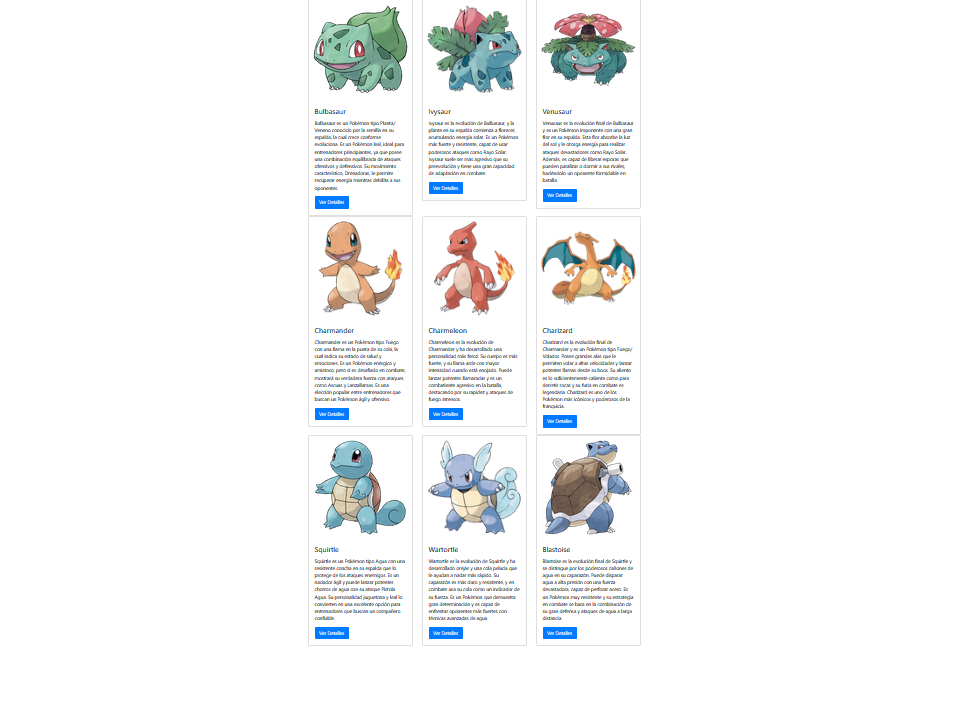

# **Instrucciones para la Implementación de las Funciones de Pokémon**

## **Objetivo**
1. Descarga los archivos **HTML** y **JS** que incluyen la estructura base:
   - El archivo **HTML** contiene el diseño y los `div` donde se mostrarán los Pokémon.
   - El archivo **JS** incluye el arreglo `ListaPokemon`, con los datos de cada Pokémon.

2. **Crear una función para cada uno de los objetos en el arreglo `ListaPokemon`**, desde la posición `0` hasta la posición `8`.  
   - Cada función debe actualizar dinámicamente el contenido de los `div` con los `id` correspondientes (`IdPokemon0` hasta `IdPokemon8`).
   - Debe mostrar la información del Pokémon dentro de una tarjeta de **Bootstrap**.

## **Resultado Esperado**
Debes lograr el siguiente resultado:


---

## **Datos Proporcionados**
### **1. Estructura del HTML con los `div` para cada Pokémon**
```html
<div id="IdPokemon0" class="col-md-4"></div>
<div id="IdPokemon1" class="col-md-4"></div>
<div id="IdPokemon2" class="col-md-4"></div>
<div id="IdPokemon3" class="col-md-4"></div>
<div id="IdPokemon4" class="col-md-4"></div>
<div id="IdPokemon5" class="col-md-4"></div>
<div id="IdPokemon6" class="col-md-4"></div>
<div id="IdPokemon7" class="col-md-4"></div>
<div id="IdPokemon8" class="col-md-4"></div>
```

## **Formato de la Función**
Cada función debe seguir el siguiente formato:

```javascript
function Mostrar_Pokemon_Posicion0() {
    document.getElementById("Aqui el ID de posicion 0").innerHTML = `
        <div>
            <div class="card">
                
                <div class="card-body">
                    <h4 class="card-title">Aqui el nombre de posicion 0</h4>
                    <p class="card-text">Aqui el nombre de posicion 0</p>
                    <button class="btn btn-primary" onclick="">Ver Detalles</button>
                </div>
            </div>
        </div>
    `;
}
```

## **Llamado de las Funciones**
Recuerda llamar las funciones con botones en el **HTML** o directamente en el **JS** para visualizar los Pokémon en pantalla.

### **Ejemplo de Llamado en JavaScript**
```javascript
Mostrar_Pokemon_Posicion0();
Mostrar_Pokemon_Posicion1();
Mostrar_Pokemon_Posicion2();
Mostrar_Pokemon_Posicion3();
Mostrar_Pokemon_Posicion4();
Mostrar_Pokemon_Posicion5();
Mostrar_Pokemon_Posicion6();
Mostrar_Pokemon_Posicion7();
Mostrar_Pokemon_Posicion8();
```